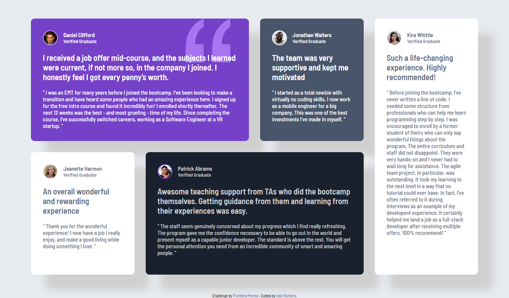

# Frontend Mentor - Testimonials grid section solution

This is a solution to the [Testimonials grid section challenge on Frontend Mentor](https://www.frontendmentor.io/challenges/testimonials-grid-section-Nnw6J7Un7). Frontend Mentor challenges help you improve your coding skills by building realistic projects. 

## Table of contents

- [Overview](#overview)
  - [The challenge](#the-challenge)
  - [Screenshot](#screenshot)
  - [Links](#links)
- [My process](#my-process)
  - [Built with](#built-with)
  - [What I learned](#what-i-learned)
  - [Continued development](#continued-development)
- [Author](#author)

**Note: Delete this note and update the table of contents based on what sections you keep.**

## Overview

### The challenge

Users should be able to:

- View the optimal layout for the site depending on their device's screen size

### Screenshot

### Links

- Solution URL: [Solution URL here](https://github.com/IvanRL-11/testimonial-grid)
- Live Site URL: [Live site URL here](https://your-live-site-url.com)

## My process

### Built with

- Semantic HTML5 markup
- CSS custom properties
- Flexbox
- CSS Grid

### What I learned

Planificar antes de empzar a escribir código ayuda mucho, además reduce el tiempo de trabajo.
Tambien el usar las propiedades de grid para poder hacer diseños responsivos y interesantes.

### Continued development

Quiero continuar practicando con display grid para poder desarrollar sitios responsivos y dinamicos.

## Author

- Website - [Iván Romero](https://github.com/IvanRL-11)
- Frontend Mentor - [@IvanRL-11](https://www.frontendmentor.io/profile/IvanRL-11)

